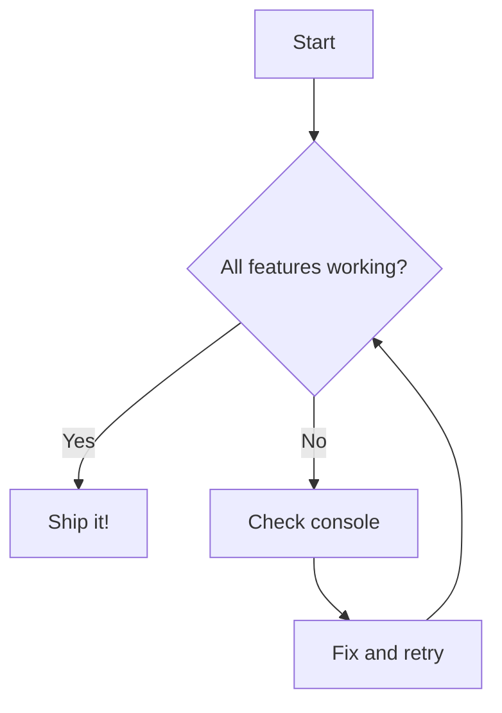
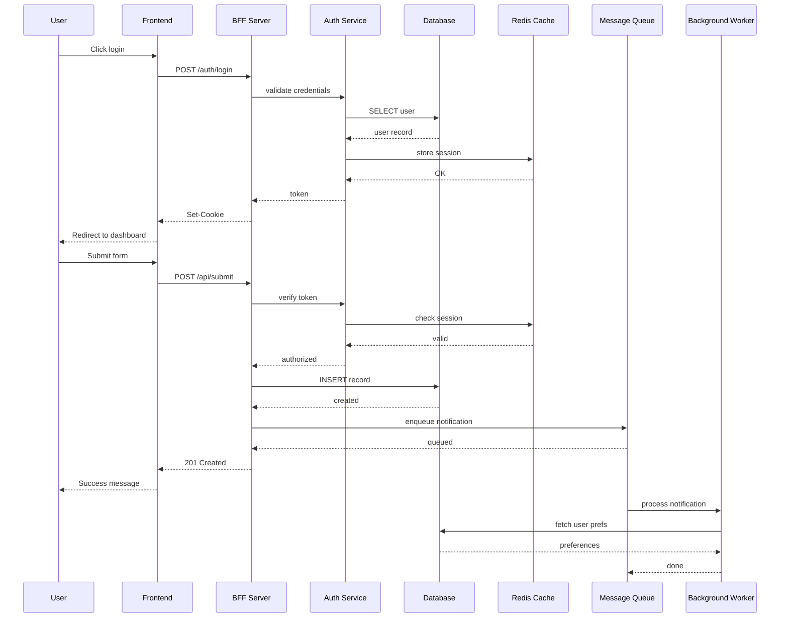

# All Features Checklist

Use this page to verify every SDK feature in one place.

## Verification checklist

| # | Feature | Test | Expected |
|---|---------|------|----------|
| 1 | **Zoom controls** | Click +/- buttons in the 3×3 grid | Diagram zooms in/out |
| 2 | **Pan controls** | Click arrow buttons in the 3×3 grid | Diagram pans |
| 3 | **Reset** | Click the reset button (center of grid) | Diagram resets to fit |
| 4 | **Expand modal** | Click expand icon (top-right) | Fullscreen modal opens |
| 5 | **Modal wheel zoom** | Scroll inside the modal | Diagram zooms in/out |
| 6 | **Modal close (Escape)** | Press Escape while modal is open | Modal closes |
| 7 | **Modal close (backdrop)** | Click outside the diagram in modal | Modal closes |
| 8 | **Copy source** | Click copy icon (top-right) | Source copied to clipboard |
| 9 | **Inline wheel zoom OFF** | Scroll over diagram below | Page scrolls, not diagram |
| 10 | **Dark mode** | Toggle dark mode in navbar | Diagrams adapt colors |

## Test diagram

## Large diagram (for pan/zoom testing)

This large diagram is ideal for testing:
- **Pan controls** — the diagram is wide, so panning left/right is useful
- **Zoom out** — zoom out to see the full picture
- **Expand modal** — open fullscreen for a better view, then scroll to zoom
