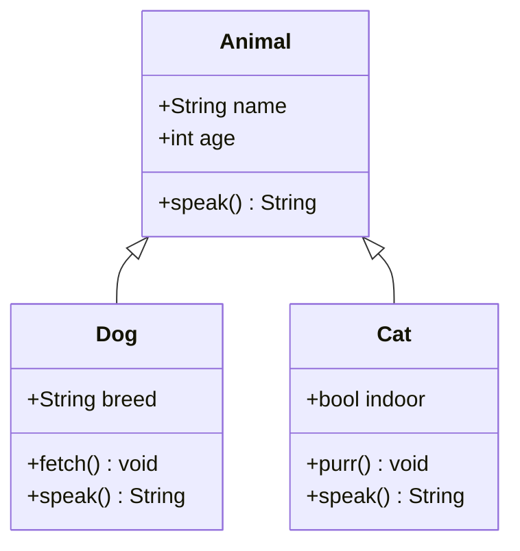
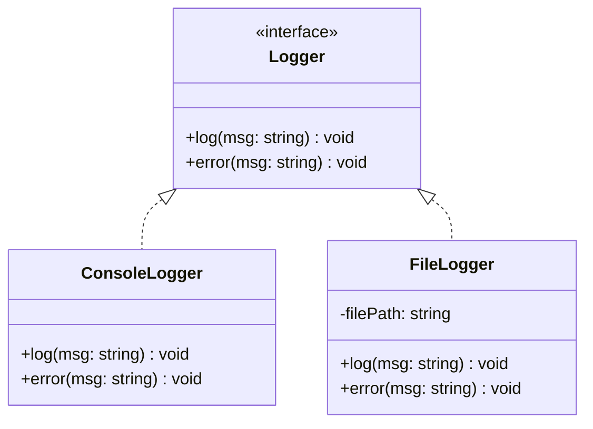

# Class Diagram

Test copy button and zoom controls on class diagrams.

## Inheritance

**Verify:** Click the **copy icon** (top-right) — the Mermaid source should be copied to your clipboard.

## Interface pattern

