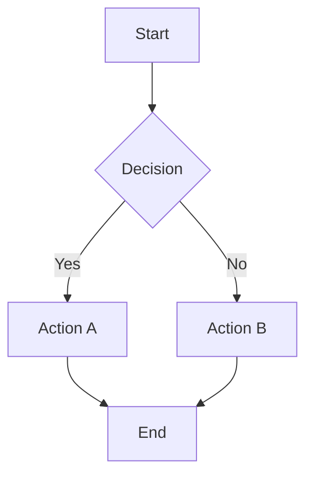
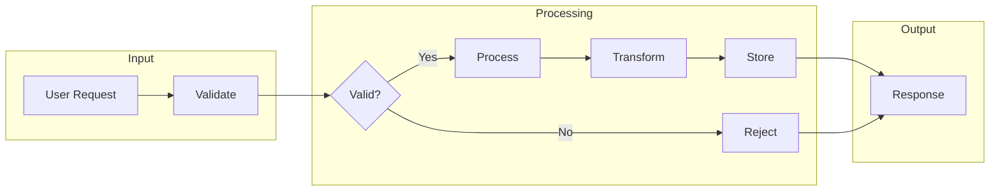

# Flowchart

Test pan/zoom controls and inline scroll behavior on flowchart diagrams.

## Simple decision flow

**Verify:** Scroll over the diagram above — the page should scroll, not the diagram
(inline wheel zoom is disabled by default).

## Complex flow

**Verify:** Use the 3×3 control grid (bottom-right) to pan and zoom.
Click the expand icon (top-right) to open fullscreen — scroll should zoom in the modal.
