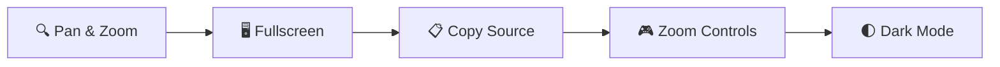

# mermaid-diagram-pan-zoom

Enhance your [Mermaid](https://mermaid.js.org/) diagrams with **pan, zoom, fullscreen, copy, and zoom controls** — framework-agnostic, plug-and-play.

<p align="center">

[](https://www.npmjs.com/package/mermaid-diagram-pan-zoom)
[](https://www.npmjs.com/package/docusaurus-plugin-mermaid-pan-zoom)
[](https://github.com/im-bravo/mermaid-diagram-enhancements/blob/main/LICENSE)

</p>



---

## Packages

This project provides two packages — choose the one that fits your stack.

| Package | npm | Description |
|---------|-----|-------------|
| `docusaurus-plugin-mermaid-pan-zoom` | [](https://www.npmjs.com/package/docusaurus-plugin-mermaid-pan-zoom) | Zero-config Docusaurus plugin. **Recommended for Docusaurus users.** |
| `mermaid-diagram-pan-zoom` | [](https://www.npmjs.com/package/mermaid-diagram-pan-zoom) | Framework-agnostic SDK for VitePress, custom sites, and other frameworks. |

**Which one should you use?**

- 👉 Using **Docusaurus**? → `docusaurus-plugin-mermaid-pan-zoom`
- 👉 Everything else (VitePress, plain HTML, etc.)? → `mermaid-diagram-pan-zoom`

---

## Installation

### Option 1: Docusaurus Plugin (Recommended)

```bash npm2yarn
npm install docusaurus-plugin-mermaid-pan-zoom
```

```bash title="pnpm"
pnpm add docusaurus-plugin-mermaid-pan-zoom
```

```bash title="yarn"
yarn add docusaurus-plugin-mermaid-pan-zoom
```

Then enable it in `docusaurus.config.js`:

```js title="docusaurus.config.js"
module.exports = {
  themes: ['@docusaurus/theme-mermaid'],
  plugins: [
    'docusaurus-plugin-mermaid-pan-zoom', // 👈 add this
  ],
  markdown: {
    mermaid: true,
  },
};
```

That's it. **No client modules, no custom CSS, no swizzling.**

### Option 2: Framework-Agnostic SDK

```bash npm2yarn
npm install mermaid-diagram-pan-zoom svg-pan-zoom
```

```bash title="pnpm"
pnpm add mermaid-diagram-pan-zoom svg-pan-zoom
```

```bash title="yarn"
yarn add mermaid-diagram-pan-zoom svg-pan-zoom
```

Then initialize in your app:

```js title="app.js"
import { init, enhance } from 'mermaid-diagram-pan-zoom';
import 'mermaid-diagram-pan-zoom/styles/mermaid-enhancements.css';

init({
  containerSelector: '.docusaurus-mermaid-container',
  enableCopy: true,
  enableExpand: true,
  enableZoomControls: true,
  enableWheelZoom: true,
});

// Call enhance() when the DOM changes (e.g. SPA route navigation)
enhance();
```

---

## Configuration

All available options with their defaults and descriptions.

### SDK Options (`init()`)

| Option | Type | Default | Description |
|--------|------|---------|-------------|
| `containerSelector` | `string` | `'.docusaurus-mermaid-container'` | CSS selector for Mermaid diagram containers |
| `sourceAttribute` | `string` | `'data-mermaid-source'` | Attribute on the container that holds the Mermaid source code (used by the copy button) |
| `enableCopy` | `boolean` | `true` | Show the **copy source** button on diagrams |
| `enableExpand` | `boolean` | `true` | Show the **fullscreen expand** button on diagrams |
| `enableZoomControls` | `boolean` | `true` | Show the **3×3 pan/zoom control grid** (GitHub-style) |
| `enableWheelZoom` | `boolean` | `true` | Enable **mouse wheel zoom** inside the fullscreen modal |
| `enableInlineWheelZoom` | `boolean` | `false` | Enable **mouse wheel zoom** on inline (non-modal) diagrams. Disabled by default to avoid blocking page scroll. |
| `wheelZoomRequiresCtrl` | `boolean` | `false` | When `true`, the user must hold the `Ctrl`/`Cmd` key to wheel-zoom. When `false`, scrolling always zooms (in modal or inline). |
| `intrinsicHeightScale` | `number` | `1.0` | Adjust the computed intrinsic height of diagram SVGs. Increase (e.g. `1.2`) to give tall diagrams more room, decrease to compress them. |
| `panZoomOptions` | `object` | `{}` | Additional options passed directly to [svg-pan-zoom](https://github.com/bumbu/svg-pan-zoom). Overrides any SDK defaults. |

### Docusaurus Plugin Options

Pass these in your `docusaurus.config.js` under the plugin entry:

```js title="docusaurus.config.js"
plugins: [
  ['docusaurus-plugin-mermaid-pan-zoom', {
    enableInlineWheelZoom: true,
    wheelZoomRequiresCtrl: true,
    intrinsicHeightScale: 1.2,
  }],
],
```

The plugin accepts all SDK options listed above. Its Docusaurus-specific defaults differ slightly:

| Option | Plugin Default | SDK Default | Notes |
|--------|---------------|-------------|-------|
| `enableInlineWheelZoom` | `true` | `false` | The plugin ships with inline wheel zoom enabled |
| `wheelZoomRequiresCtrl` | `true` | `false` | Ctrl/Cmd key required for wheel zoom by default |
| `intrinsicHeightScale` | `1.2` | `1.0` | Slightly taller default to prevent cropping |

---

## Features

| Feature | Description | Icon |
|---------|-------------|------|
| **Pan & Zoom** | Drag to pan, scroll to zoom. Smooth interactions powered by [svg-pan-zoom](https://github.com/bumbu/svg-pan-zoom). | 🔍 |
| **Zoom Controls** | GitHub-style 3×3 button grid: up/down/left/right pan, zoom in/out, and reset. | 🎮 |
| **Fullscreen Modal** | Click the expand button to view any diagram in a fullscreen overlay. Press `Escape` or click the backdrop to close. | 🖥️ |
| **Copy Source** | Click the copy button to copy the Mermaid source code to your clipboard. | 📋 |
| **Auto-Enhance** | When used with the Docusaurus plugin, diagrams are automatically enhanced after SPA route changes. No manual calls needed. | 🔄 |
| **Dark Mode** | Automatically adapts diagram theme when toggling dark/light mode. | 🌓 |
| **Framework-Agnostic** | Works with Docusaurus, VitePress, or any plain HTML page. | 🧩 |

---

## Requirements

| Environment | Requirement |
|-------------|-------------|
| **Docusaurus Plugin** | `@docusaurus/core >= 3.0.0`, `@docusaurus/theme-mermaid >= 3.0.0` |
| **SDK** | Any modern browser, no framework required |
| **Node.js** | `>= 18.0` (for package installation only) |

---

## Try It

Browse the sidebar pages to see the SDK in action with different diagram types:

- [Flowchart](/flowchart) — Basic flowchart with pan/zoom
- [Sequence Diagram](/sequence-diagram) — Sequence diagrams with interactions
- [Class Diagram](/class-diagram) — UML class diagrams
- [State Diagram](/state-diagram) — State transition diagrams
- [Large Sequence Diagram](/large-sequence-diagram) — Stress-test pan/zoom on a complex diagram
- [All Features](/all-features) — Complete feature verification checklist

---

## Repository

[](https://github.com/im-bravo/mermaid-diagram-enhancements)

## License

MIT © [im-bravo](https://github.com/im-bravo)
