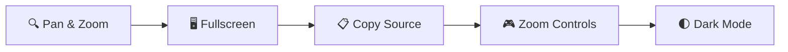

# mermaid-diagram-pan-zoom

Enhance your [Mermaid](https://mermaid.js.org/) diagrams with **pan, zoom, fullscreen, copy, and zoom controls** — framework-agnostic, plug-and-play.

<p align="center">

[](https://www.npmjs.com/package/mermaid-diagram-pan-zoom)
[](https://www.npmjs.com/package/docusaurus-plugin-mermaid-pan-zoom)
[](https://github.com/im-bravo/mermaid-diagram-enhancements/blob/main/LICENSE)

</p>



---

## Packages

This project provides two packages — choose the one that fits your stack.

| Package | npm | Description |
|---------|-----|-------------|
| `docusaurus-plugin-mermaid-pan-zoom` | [](https://www.npmjs.com/package/docusaurus-plugin-mermaid-pan-zoom) | Zero-config Docusaurus plugin. **Recommended for Docusaurus users.** |
| `mermaid-diagram-pan-zoom` | [](https://www.npmjs.com/package/mermaid-diagram-pan-zoom) | Framework-agnostic SDK for VitePress, custom sites, and other frameworks. |

**Which one should you use?**

- 👉 Using **Docusaurus**? → `docusaurus-plugin-mermaid-pan-zoom`
- 👉 Everything else (VitePress, plain HTML, etc.)? → `mermaid-diagram-pan-zoom`

---

## Installation

### Option 1: Docusaurus Plugin (Recommended)

```bash npm2yarn
npm install docusaurus-plugin-mermaid-pan-zoom
```

```bash title="pnpm"
pnpm add docusaurus-plugin-mermaid-pan-zoom
```

```bash title="yarn"
yarn add docusaurus-plugin-mermaid-pan-zoom
```

Then enable it in `docusaurus.config.js`:

```js title="docusaurus.config.js"
module.exports = {
  themes: ['@docusaurus/theme-mermaid'],
  plugins: [
    'docusaurus-plugin-mermaid-pan-zoom', // 👈 add this
  ],
  markdown: {
    mermaid: true,
  },
};
```

That's it. **No client modules, no custom CSS, no swizzling.**

### Option 2: Framework-Agnostic SDK

```bash npm2yarn
npm install mermaid-diagram-pan-zoom svg-pan-zoom
```

```bash title="pnpm"
pnpm add mermaid-diagram-pan-zoom svg-pan-zoom
```

```bash title="yarn"
yarn add mermaid-diagram-pan-zoom svg-pan-zoom
```

Then initialize in your app:

```js title="app.js"
import { init, enhance } from 'mermaid-diagram-pan-zoom';
import 'mermaid-diagram-pan-zoom/styles/mermaid-enhancements.css';

init({
  containerSelector: '.docusaurus-mermaid-container',
  enableCopy: true,
  enableExpand: true,
  enableZoomControls: true,
  enableWheelZoom: true,
});

// Call enhance() when the DOM changes (e.g. SPA route navigation)
enhance();
```

---

## Configuration

All available options with their defaults and descriptions.

### SDK Options (`init()`)

| Option | Type | Default | Description |
|--------|------|---------|-------------|
| `containerSelector` | `string` | `'.docusaurus-mermaid-container'` | CSS selector for Mermaid diagram containers |
| `sourceAttribute` | `string` | `'data-mermaid-source'` | Attribute on the container that holds the Mermaid source code (used by the copy button) |
| `enableCopy` | `boolean` | `true` | Show the **copy source** button on diagrams |
| `enableExpand` | `boolean` | `true` | Show the **fullscreen expand** button on diagrams |
| `enableZoomControls` | `boolean` | `true` | Show the **3×3 pan/zoom control grid** (GitHub-style) |
| `enableWheelZoom` | `boolean` | `true` | Enable **mouse wheel zoom** inside the fullscreen modal |
| `enableInlineWheelZoom` | `boolean` | `true` | Enable **mouse wheel zoom** on inline (non-modal) diagrams. |
| `wheelZoomRequiresCtrl` | `boolean` | `true` | When `true`, the user must hold the `Ctrl`/`Cmd` key to wheel-zoom inline diagrams. When `false`, scrolling always zooms. (In the fullscreen modal, wheel zoom is always free.) |
| `wheelZoomSensitivity` | `number` | `0.05` | Controls how sensitive the wheel zoom is. Lower values = slower zoom, higher = faster. |
| `intrinsicHeightScale` | `number` | `1.2` | Adjust the computed intrinsic height of diagram SVGs. Increase (e.g. `1.5`) to give tall diagrams more room, decrease to compress them. |
| `panZoomOptions` | `object` | `{}` | Additional options passed directly to [svg-pan-zoom](https://github.com/bumbu/svg-pan-zoom). See [panZoomOptions breakdown](#panzoomoptions) below. |

### Docusaurus Plugin Options

Pass these in your `docusaurus.config.js` under the plugin entry:

```js title="docusaurus.config.js"
plugins: [
  ['docusaurus-plugin-mermaid-pan-zoom', {
    enableInlineWheelZoom: true,
    wheelZoomRequiresCtrl: true,
    intrinsicHeightScale: 1.2,
  }],
],
```

The plugin accepts **all SDK options** listed above. Docusaurus-specific defaults are the same as the SDK defaults shown above — no surprises.

### panZoomOptions

Fine-tune the underlying [svg-pan-zoom](https://github.com/bumbu/svg-pan-zoom) instance. These override the SDK's internal defaults:

| Option | SDK Default | Description |
|--------|-------------|-------------|
| `panZoomOptions.zoomEnabled` | `true` | Enable zooming |
| `panZoomOptions.panEnabled` | `true` | Enable panning |
| `panZoomOptions.controlIconsEnabled` | `false` | svg-pan-zoom's built-in controls (SDK provides its own) |
| `panZoomOptions.fit` | `true` | Fit diagram to container on init |
| `panZoomOptions.center` | `true` | Center diagram on init |
| `panZoomOptions.mouseWheelZoomEnabled` | `false` | svg-pan-zoom's built-in wheel zoom (SDK uses a custom handler) |
| `panZoomOptions.dblClickZoomEnabled` | `true` | Double-click to zoom |
| `panZoomOptions.minZoom` | `0.2` | Minimum zoom level |
| `panZoomOptions.maxZoom` | `10` | Maximum zoom level |
| `panZoomOptions.zoomScaleSensitivity` | `0.1` | Zoom step sensitivity |
| `panZoomOptions.refreshRate` | `60` | Animation refresh rate (fps) |

---

## Features

### User-Facing Features

| Feature | Description | Config |
|---------|-------------|--------|
| **Pan & Zoom** | Drag to pan, scroll to zoom. Smooth interactions powered by [svg-pan-zoom](https://github.com/bumbu/svg-pan-zoom). | `panZoomOptions` |
| **Inline Wheel Zoom** | Mouse wheel zoom directly on inline diagrams. Smooth, viewport-centered logarithmic zoom with cross-browser delta normalization. | `enableInlineWheelZoom`, `wheelZoomRequiresCtrl`, `wheelZoomSensitivity` |
| **Ctrl+Scroll Hint** | When `wheelZoomRequiresCtrl` is enabled, a toast overlay appears on first scroll: *"Ctrl + scroll to zoom (⌘ on Mac)"*. Fades out after 700ms. | automatic |
| **Zoom Controls** | GitHub-style 3×3 button grid: up/down/left/right pan (animated, 10 steps over ~120ms), zoom in/out, and reset. | `enableZoomControls` |
| **Fullscreen Modal** | Click the expand button to view any diagram in a fullscreen overlay. Wheel zoom is always free in the modal (no Ctrl required). Press `Escape` or click the backdrop to close. | `enableExpand` |
| **Copy Source** | Click the copy button to copy the Mermaid source code to clipboard with visual checkmark feedback (1.5s). Resolves source from DOM attributes or React Fiber tree. | `enableCopy`, `sourceAttribute` |
| **Dark Mode** | CSS adjusts diagram fill colors under `[data-theme='dark']` for proper rendering in dark themes. | automatic |

### Automatic Behaviors (Zero-Config)

| Behavior | What It Does |
|----------|-------------|
| **Lazy Enhancement** | Uses `IntersectionObserver` to only enhance diagrams when they approach the viewport (`rootMargin: 50px`). Saves resources on pages with many off-screen diagrams. |
| **Auto-Discovery** | A `MutationObserver` on `document.body` watches for new diagram containers added to the DOM. Rate-limited via `requestAnimationFrame`. |
| **SVG Re-render Detection** | A per-container `MutationObserver` detects when Mermaid replaces the SVG (e.g., on dark/light theme toggle) and automatically re-applies all enhancements to the new SVG. |
| **Window Resize Sync** | Each container listens for `window.resize`, validates the SVG is renderable, and calls `fit()` + `center()` to keep the diagram correctly sized. Retries up to 2 times on transient failures. |
| **SPA Route Changes** | Listens for `hashchange` events and re-scans for new diagrams. The Docusaurus plugin also hooks into `onRouteDidUpdate` for history-based routing. |
| **Staggered Init** | Initial `enhance()` calls are staggered at 100ms, 500ms, 1500ms, and 3000ms to give Mermaid time to finish rendering before enhancements are applied. |
| **Async Load** | `svg-pan-zoom` is loaded via dynamic `import()` — no blocking bundle cost until a diagram is actually enhanced. |
| **React Fiber Fallback** | If the Mermaid source isn't found in a DOM attribute, the SDK walks up the React Fiber tree looking for `memoizedProps.value` — specific compatibility with Docusaurus theme-mermaid internals. |

### API

| Function | Description |
|----------|-------------|
| `init(options?)` | Initializes the SDK with optional configuration. Calls `enhance()` internally with staggered timing. |
| `enhance()` | Re-scans the DOM for new containers and feeds them into the intersection observer. Call after SPA route changes. |
| `destroy()` | Cleans up all observers (`MutationObserver`, `IntersectionObserver`), event listeners (`hashchange`, `resize`), and per-container bookkeeping. Resets internal state. |

---

## Requirements

| Environment | Requirement |
|-------------|-------------|
| **Docusaurus Plugin** | `@docusaurus/core >= 3.0.0`, `@docusaurus/theme-mermaid >= 3.0.0` |
| **SDK** | Any modern browser, no framework required |
| **Node.js** | `>= 18.0` (for package installation only) |

---

## Try It

Browse the sidebar pages to see the SDK in action with different diagram types:

- [Flowchart](/flowchart) — Basic flowchart with pan/zoom
- [Sequence Diagram](/sequence-diagram) — Sequence diagrams with interactions
- [Class Diagram](/class-diagram) — UML class diagrams
- [State Diagram](/state-diagram) — State transition diagrams
- [Large Sequence Diagram](/large-sequence-diagram) — Stress-test pan/zoom on a complex diagram
- [All Features](/all-features) — Complete feature verification checklist

---

## Repository

[](https://github.com/im-bravo/mermaid-diagram-enhancements)

## License

MIT © [im-bravo](https://github.com/im-bravo)
