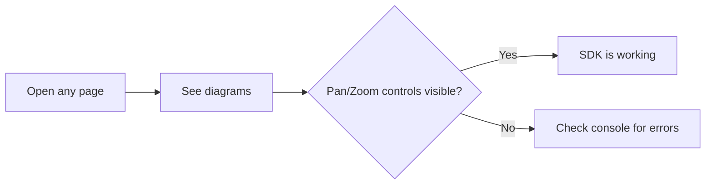

# mermaid-diagram-pan-zoom

This Docusaurus site demonstrates the **mermaid-diagram-pan-zoom** SDK using the
`docusaurus-plugin-mermaid-pan-zoom` plugin — both loaded from the local workspace.

## What to verify

| Feature | How to test |
|---------|-------------|
| **Pan/Zoom controls** | 3×3 button grid at bottom-right of each diagram |
| **Expand (fullscreen)** | Click the expand icon at top-right |
| **Copy source** | Click the copy icon at top-right |
| **Inline wheel zoom disabled** | Scroll over a diagram — the **page** should scroll, not the diagram |
| **Modal wheel zoom enabled** | Open fullscreen modal → scroll to zoom the diagram |
| **Dark mode** | Toggle dark mode in the navbar — diagrams should adapt |

## Quick test

Browse the sidebar pages to test different diagram types.
