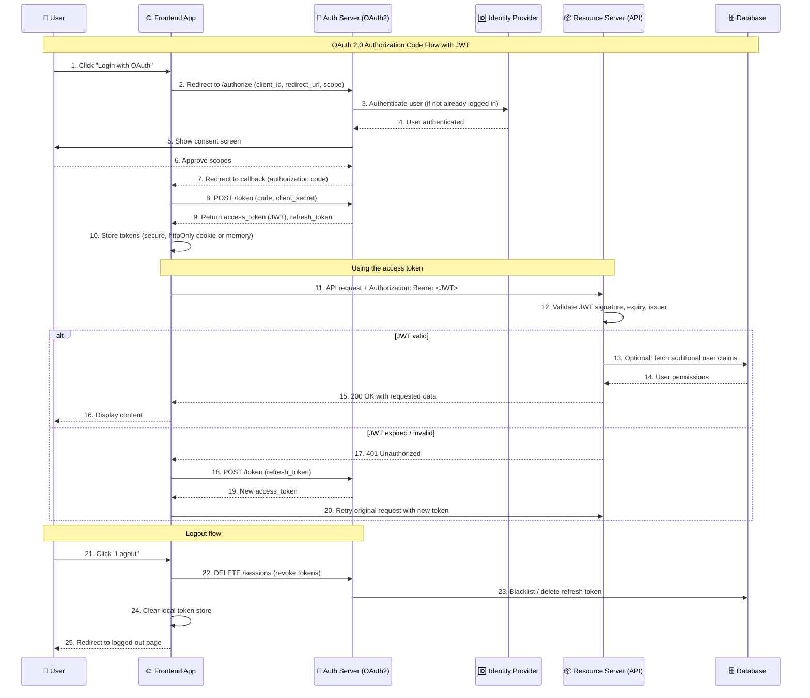

# large sequence diagram

```mermaid

sequenceDiagram
    participant User as 👤 User
    participant Frontend as 🌐 Frontend App
    participant AuthSrv as 🔐 Auth Server (OAuth2)
    participant IdP as 🆔 Identity Provider
    participant ResSrv as 📦 Resource Server (API)
    participant DB as 🗄️ Database

    Note over User,DB: OAuth 2.0 Authorization Code Flow with JWT

    User->>Frontend: 1. Click "Login with OAuth"
    Frontend->>AuthSrv: 2. Redirect to /authorize (client_id, redirect_uri, scope)
    AuthSrv->>IdP: 3. Authenticate user (if not already logged in)
    IdP-->>AuthSrv: 4. User authenticated
    AuthSrv->>User: 5. Show consent screen
    User-->>AuthSrv: 6. Approve scopes
    AuthSrv-->>Frontend: 7. Redirect to callback (authorization code)
    Frontend->>AuthSrv: 8. POST /token (code, client_secret)
    AuthSrv-->>Frontend: 9. Return access_token (JWT), refresh_token
    Frontend->>Frontend: 10. Store tokens (secure, httpOnly cookie or memory)

    Note over Frontend,ResSrv: Using the access token

    Frontend->>ResSrv: 11. API request + Authorization: Bearer <JWT>
    ResSrv->>ResSrv: 12. Validate JWT signature, expiry, issuer
    alt JWT valid
        ResSrv->>DB: 13. Optional: fetch additional user claims
        DB-->>ResSrv: 14. User permissions
        ResSrv-->>Frontend: 15. 200 OK with requested data
        Frontend-->>User: 16. Display content
    else JWT expired / invalid
        ResSrv-->>Frontend: 17. 401 Unauthorized
        Frontend->>AuthSrv: 18. POST /token (refresh_token)
        AuthSrv-->>Frontend: 19. New access_token
        Frontend->>ResSrv: 20. Retry original request with new token
    end

    Note over User,AuthSrv: Logout flow

    User->>Frontend: 21. Click "Logout"
    Frontend->>AuthSrv: 22. DELETE /sessions (revoke tokens)
    AuthSrv->>DB: 23. Blacklist / delete refresh token
    Frontend->>Frontend: 24. Clear local token store
    Frontend-->>User: 25. Redirect to logged-out page


```
