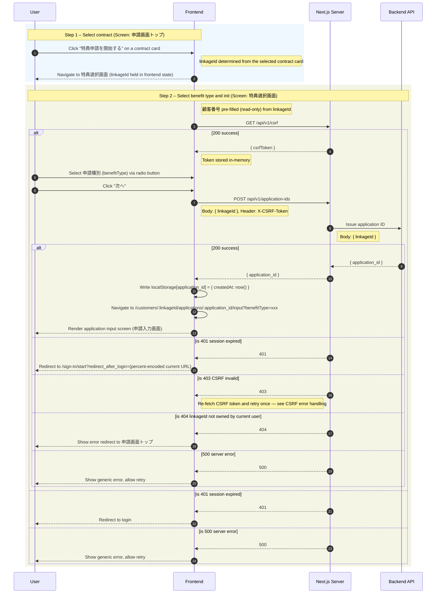

# large sequence diagram

```mermaid

sequenceDiagram
    autonumber
    participant U as User
    participant FE as Frontend
    participant NS as Next.js Server
    participant API as Backend API

    rect rgb(240, 248, 255)
    Note over U,FE: Step 1 – Select contract (Screen: 申請画面トップ)

    U ->> FE: Click "特典申請を開始する" on a contract card
    Note right of FE: linkageId determined from the selected contract card
    FE -->> U: Navigate to 特典選択画面 (linkageId held in frontend state)
    end

    rect rgb(245, 245, 230)
        Note over U,API: Step 2 – Select benefit type and init (Screen: 特典選択画面)

        Note right of FE: 顧客番号 pre-filled (read-only) from linkageId
        FE ->> NS: GET /api/v1/csrf
        alt 200 success
            NS -->> FE: { csrfToken }
            Note right of FE: Token stored in-memory
            U ->> FE: Select 申請種別 (benefitType) via radio button
            U ->> FE: Click "次へ"
            FE ->> NS: POST /api/v1/application-ids
            Note right of FE: Body: { linkageId }, Header: X-CSRF-Token
            NS ->> API: Issue application ID
            Note right of NS: Body: { linkageId }
            alt 200 success
                API -->> NS: { application_id }
                NS -->> FE: { application_id }
                FE ->> FE: Write localStorage[application_id] = { createdAt: now() }
                FE ->> FE: Navigate to /customers/:linkageId/applications/:application_id/input?benefitType=xxx
                FE -->> U: Render application input screen (申請入力画面)
            else is 401 session expired
                NS -->> FE: 401
                FE -->> U: Redirect to /sign-in/start?redirect_after_login=(percent-encoded current URL)
            else is 403 CSRF invalid
                NS -->> FE: 403
                Note right of FE: Re-fetch CSRF token and retry once — see CSRF error handling
            else is 404 linkageId not owned by current user
                NS -->> FE: 404
                FE -->> U: Show error redirect to 申請画面トップ
            else 500 server error
                NS -->> FE: 500
                FE -->> U: Show generic error, allow retry
            end
        else is 401 session expired
            NS -->> FE: 401
            FE -->> U: Redirect to login
        else is 500 server error
            NS -->> FE: 500
            FE -->> U: Show generic error, allow retry
        end
    end


```