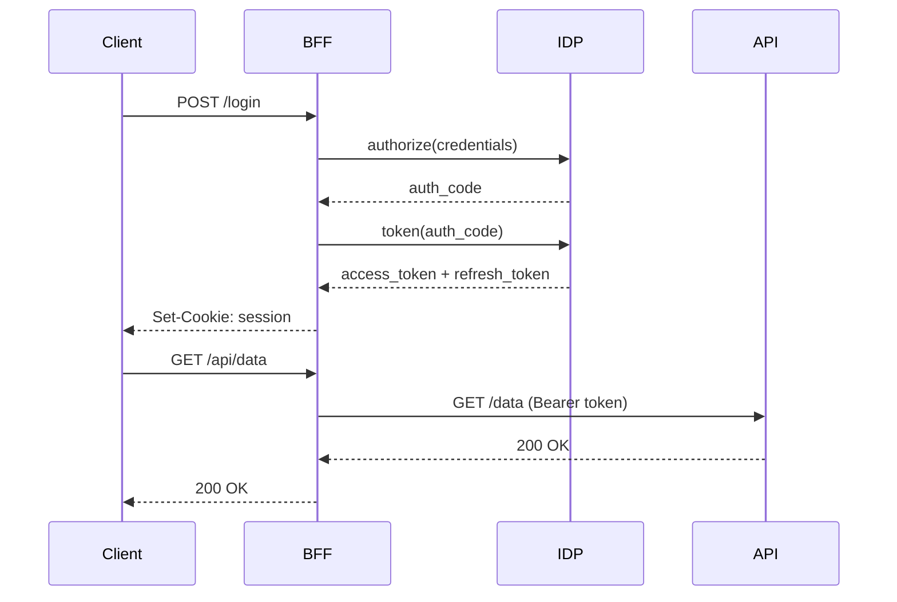
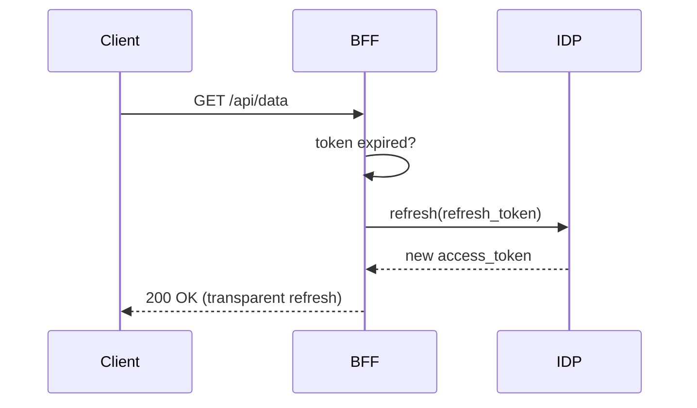

# Sequence Diagram

Test expand/fullscreen modal and wheel zoom behavior.

## Authentication flow

**Verify:**
1. Click the **expand icon** (top-right) to open the popup modal
2. In the modal, scroll to zoom in/out — this should work (`enableWheelZoom` is ON)
3. Press **Escape** or click the backdrop to close

## Token refresh

