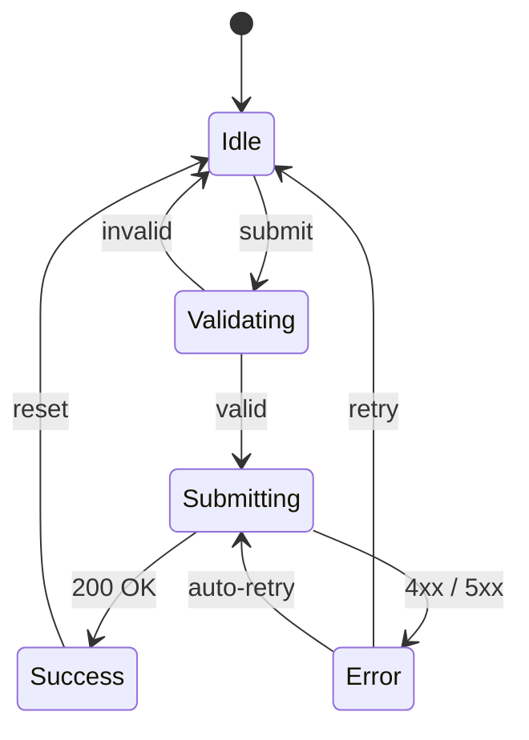
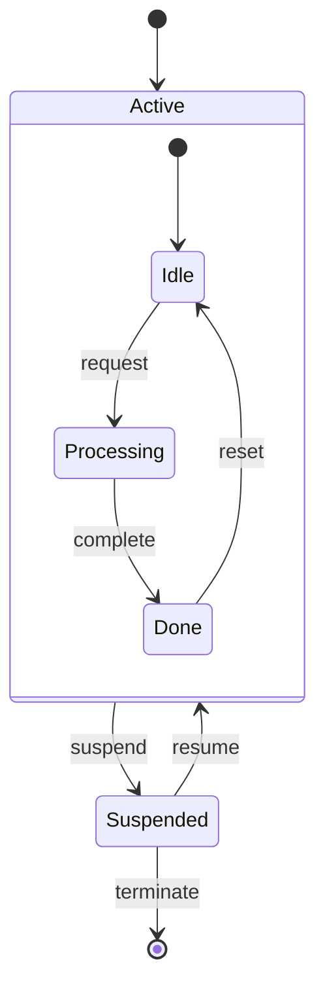

# State Diagram

Test pan controls and dark mode rendering.

## Form submission states

**Verify:**
1. Use the **arrow buttons** in the control grid to pan the diagram
2. Toggle **dark mode** (sun/moon icon in navbar) — the diagram should adapt

## Nested states

